# LR6
Лабораторная работа №6
## 1. Создание аккаунта на GitHub
- Зарегистрирован аккаунт на сайте [GitHub](https://github.com/)
- Сделан форк репозитория: [https://github.com/Kurtyanik/LR6/](https://github.com/Kurtyanik/LR6)
- Скриншот:
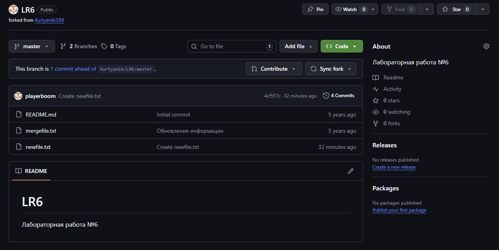
```


---


## 2. Установка и настройка Git
- Git установлен с официального сайта: [https://git-scm.com/](https://git-scm.com/)
- Настройка имени пользователя и email
- Скриншот:
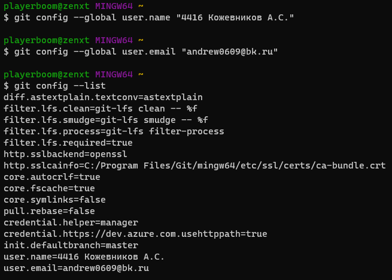
- Команды:
```bash
git config --global user.name "4416 Кожевников А.С."
git config --global user.email "andrew0609@bk.ru"
```
---


## 3. Клонирование репозитория
- Клонирование своего форка на локальный компьютер
- Скриншот:
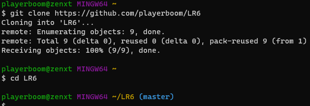
- Команды:
```bash
git clone https://github.com/playerboom/LR6
cd LR6
```


---


## 4. Добавление файла через интерфейс GitHub и подтягивание изменений
- Создан файл `newfile.txt` через веб-интерфейс GitHub
- Подтянут в локальный репозиторий
- Скриншот:
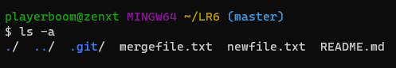
- Команды:
```bash
git pull
```

---


## 5. Работа с ветками и история коммитов
- Просмотр локальных и удалённых веток
- Получение истории коммитов
- Скриншот:
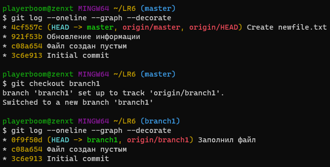
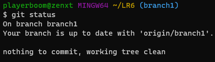
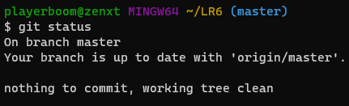
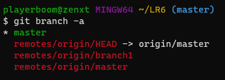
- Команды:
```bash
git branch -a
(master) git log --oneline --graph --decorate
(branch1) git log --oneline --graph --decorate
```


---


## 6. Просмотр последних изменений
- Проверка состояния репозитория
- Сравнение веток
- Скриншот:
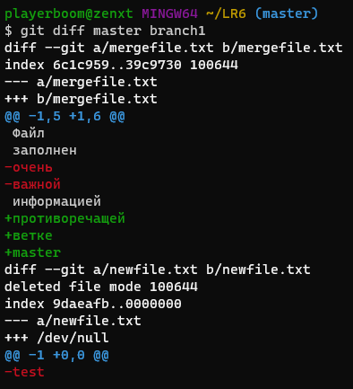
- Команды:
```bash
git status
git diff master branch1
```


---


## 7. Слияние веток и разрешение конфликта
- Переключение на ветку `master` и слияние с `branch1`
- Разрешение конфликта в `mergefile.txt`
- Скриншот:
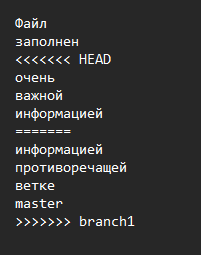
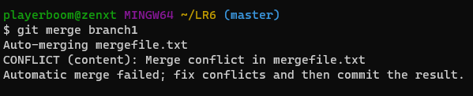
- Команды:
```bash
git checkout master
git merge branch1
git add mergefile.txt
git commit -m "Разрешён конфликт при слиянии branch1 и master"
```


---


## 8. Удаление побочной ветки
- Удаление локальной ветки после успешного слияния
- Скриншот:
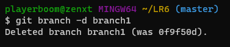
- Команды:
```bash
git branch -d branch1
```


---


## 9. Последующие изменения и коммиты
- Внесены изменения в файл `newfile.txt`
- Сделаны несколько коммитов с комментариями
- Скриншот:

- Команды:
```bash
echo "Добавлена новая строка" >> newfile.txt
git add README.md
git commit -m "Добавлена новая строка в newfile.txt"


echo "Вторая правка" >> newfile.txt
git add newfile.txt
git commit -m "Дополнен newfile.txt"
```


---


## 10. Откат коммита
- Откат последнего коммита (soft)
- Скриншот:
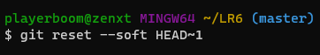
- Команды:
```bash
git reset --soft HEAD~1
```

